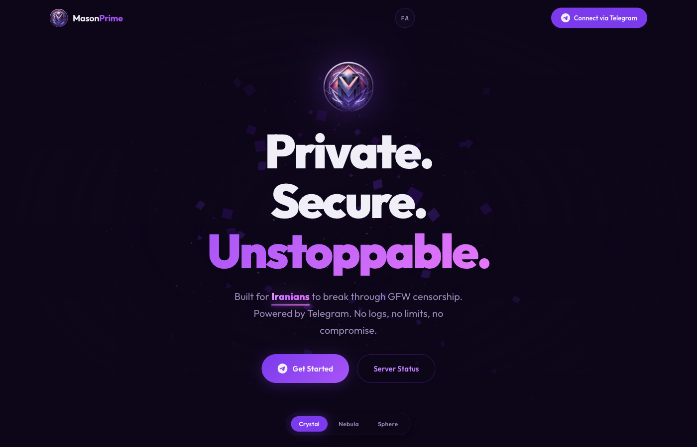

<br>

<div align="center">

# &nbsp; M A S O N P R I M E &nbsp;

**Private. Secure. Unstoppable.**

&nbsp;



&nbsp;

[](https://www.typescriptlang.org/)
[](https://threejs.org/)
[](https://gsap.com/)
[](https://vite.dev/)

&nbsp;

A privacy-first VPN landing page built for Iranian users fighting censorship.<br>
Featuring interactive 3D hero scenes, bilingual EN/FA support with RTL layout,<br>
scroll-triggered animations, and crypto-native branding.

&nbsp;

[Live Site](https://masonprime.app) · [Telegram Bot](https://t.me/Masonprimebot) · [Server Status](http://status.masonprime.store/status/mason)

</div>

&nbsp;

---

&nbsp;

## ◆ &nbsp; Overview

MasonPrime is a VPN service built specifically for users in Iran to bypass GFW censorship. This repository contains the landing page — a dark, immersive single-page application with legal subpages, designed to reflect the brand's core values: **privacy, speed, and zero compromise**.

&nbsp;

## ◆ &nbsp; Features

```
┌─────────────────────────────────────────────────────────────┐
│                                                             │
│   ◈  Three.js Hero Scenes                                  │
│      Three switchable 3D backgrounds —                      │
│      Crystal Constellation, Space Nebula, Wireframe Sphere  │
│                                                             │
│   ◈  Bilingual Interface (EN / فارسی)                       │
│      Full Persian translation with automatic RTL layout,    │
│      Vazirmatn font rendering, and localStorage persistence │
│                                                             │
│   ◈  Scroll-Triggered Animations                            │
│      GSAP ScrollTrigger powers animated stat counters,      │
│      staggered card reveals, and progress line fills         │
│                                                             │
│   ◈  Legal Pages                                            │
│      Privacy Policy & Terms of Service — lightweight        │
│      entry point (no Three.js), bilingual, fully styled     │
│                                                             │
│   ◈  Glassmorphism Design System                            │
│      Dark purple palette, frosted glass cards,              │
│      gradient borders, glow effects, and grain overlays     │
│                                                             │
│   ◈  Crypto-Native Branding                                 │
│      BTC, ETH, USDT, TON payment messaging woven            │
│      throughout — no traditional payment traces              │
│                                                             │
│   ◈  Fully Responsive                                       │
│      Mobile navigation, adaptive layouts,                   │
│      touch-friendly interactions across all breakpoints     │
│                                                             │
└─────────────────────────────────────────────────────────────┘
```

&nbsp;

## ◆ &nbsp; Tech Stack

| Layer | Technology |
|:------|:-----------|
| **Build** | Vite 7 · TypeScript 5.9 |
| **3D** | Three.js 0.183 — WebGL hero scenes |
| **Animation** | GSAP 3.14 · ScrollTrigger |
| **i18n** | Custom module — `data-i18n` attribute system |
| **Fonts** | Outfit · Space Mono · Vazirmatn (FA) |
| **Deployment** | GitHub Pages · GitHub Actions CI/CD |

&nbsp;

## ◆ &nbsp; Project Structure

```
mason-vpn/
│
├── index.html              ← Main landing page
├── terms.html              ← Terms of Service
├── privacy.html            ← Privacy Policy
├── vite.config.ts          ← Multi-page build config
├── tsconfig.json
├── package.json
│
├── public/
│   ├── logo.png            ← Brand logo
│   └── Tab.jpg             ← Favicon
│
└── src/
    ├── main.ts             ← Entry — Three.js, GSAP, i18n init
    ├── legal.ts            ← Lightweight entry for legal pages
    ├── i18n.ts             ← Translation dictionaries (EN + FA)
    ├── style.css           ← Full design system + RTL overrides
    │
    └── heroes/
        ├── crystalConstellation.ts
        ├── spaceNebula.ts
        └── wireframeSphere.ts
```

&nbsp;

## ◆ &nbsp; Getting Started

```bash
# Clone
git clone https://github.com/Sonra0/MasonPrime-Web.git
cd MasonPrime-Web

# Install
npm install

# Dev server
npm run dev

# Production build
npm run build

# Preview build
npm run preview
```

&nbsp;

## ◆ &nbsp; Pages

| Route | Description | Entry Point |
|:------|:------------|:------------|
| `/` | Main landing — hero, stats, features, steps | `src/main.ts` |
| `/terms.html` | Terms of Service | `src/legal.ts` |
| `/privacy.html` | Privacy Policy | `src/legal.ts` |

Legal pages use a separate lightweight entry point that skips Three.js and GSAP, keeping the bundle minimal.

&nbsp;

## ◆ &nbsp; Internationalization

The site ships with full **English** and **Persian (Farsi)** support.

- Toggle via the `FA` / `EN` button in the navbar
- Persian mode activates RTL layout (`dir="rtl"`) and swaps to Vazirmatn font
- Language preference persists in `localStorage`
- Translation keys live in `src/i18n.ts` — add new languages by extending the dictionaries

&nbsp;

## ◆ &nbsp; Hero Variants

Three interactive WebGL scenes built with Three.js, switchable via the top-left controls:

| Variant | Description |
|:--------|:------------|
| **Crystal** | Rotating constellation of connected particles with depth-of-field glow |
| **Nebula** | Cosmic gas cloud with volumetric lighting and drift |
| **Sphere** | Wireframe geodesic sphere with vertex displacement |

&nbsp;

---

<div align="center">

&nbsp;

**MasonPrime** · Privacy is not a privilege.

&copy; 2021–2026

&nbsp;

</div>
